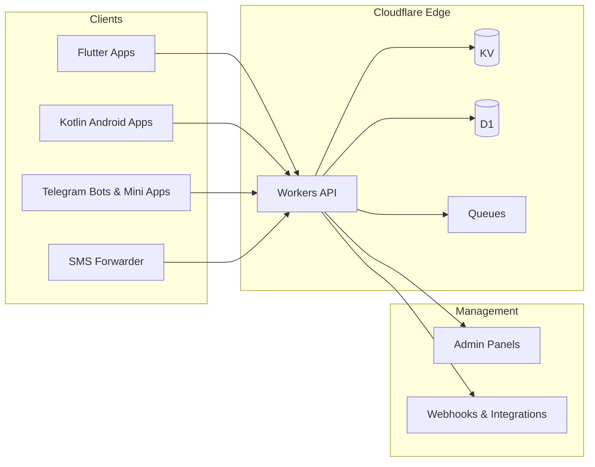

 

---

## 👨‍💻 About Me

I'm **Fahim**, a developer from **Bangladesh 🇧🇩** who builds complete, connected ecosystems — the mobile app, the
backend, the admin panel, and the automation around them — rather than isolated features.

- 📱 **Mobile** — Flutter & native Android (Kotlin) apps for streaming, downloading, proxying and payments
- ☁️ **Backend** — serverless APIs on **Cloudflare Workers** (KV, D1, Queues) and classic **PHP / MySQL**
- 🌐 **Web** — admin panels, dashboards and embedded web players (HLS, Telegram Mini Apps)
- 🤖 **Automation** — Telegram bots, SMS-forwarding pipelines, proxy & stream tooling
- 🇧🇩 **Local focus** — bKash payment verification, Bengali content platforms, tools tuned for local connectivity
- 🗣️ **Languages** — বাংলা (native) · English (technical)

> *"Design the whole system, then ship every part of it."*

---

## 🛠 Tech Stack

### Languages

### Mobile & Media

### Backend & Cloud

### Tools & DevOps

---

## 🧩 How I Build

Most of my projects share one architecture: thin, fast clients talking to a serverless edge backend, with an
admin panel and bots managing everything behind the scenes.

---

## 🚀 Featured Projects

### ⚡ [SparkTube](https://github.com/devfahim00/SparkTube)
A lightweight, fully anonymous **YouTube client for Android** built with **Kotlin** and **NewPipeExtractor** —
no Google account, no API keys, no tracking, and no live streams. Region-based trending, a music tab with genre
chips, Media3/ExoPlayer playback with multi-threaded streaming, local history & favorites, and a dark Material 3 UI.

---

### 🎬 [AdlessTube](https://github.com/devfahim00/AdlessTube)
An **ad-free, open-source YouTube client for Android** built with **Flutter** — browse, search, watch and download
videos & music with full offline playback. Ships with YouTube Music support, audio-only mode, multiple themes,
an optimized home feed and data import/export. Actively released across many versions (v1.0 → v3.0).

---

### 💳 [PayGateApp](https://github.com/devfahim00/PayGateApp)
An open-source **bKash payment gateway** in two parts: a **Flutter/Kotlin Android app** that detects incoming bKash
SMS in real time (broadcast receiver + foreground polling service as a safety net) and a **Cloudflare Worker**
backend that parses TrxIDs, verifies transactions, serves payment pages and provides an admin panel with
webhooks — no official gateway API required.

---

### 🦊 [Spark](https://github.com/devfahim00/Spark)
A **Flutter proxy/VPN client** based on **FlClash** (ClashMeta), redesigned with a minimalist UI and extended with
Telegram-based authentication, a referral system and a companion Flutter admin app.

---

### 🧩 [DxRepoCS](https://github.com/devfahim00/DxRepoCS)
A custom **CloudStream extension repository** — extra content providers/plugins written in **Kotlin** that users can
add to the CloudStream Android app by URL. MIT licensed.

---

### 🚀 [STD — Speed Test](https://github.com/devfahim00/STD)
A minimal, dark-themed **download speed tester** in Flutter. Multi-threaded HTTP streaming (1–32 parallel threads),
a live Mbps gauge, live/peak/average stats, configurable test duration and a data-usage counter. Builds for
Android, iOS, Web and Desktop, with a GitHub Actions APK workflow.

---

### 🛰 [Clash.Meta.Extra](https://github.com/devfahim00/Clash.Meta.Extra)
A customized **Mihomo (Clash.Meta) kernel** written in **Go** — rule-based routing, multi-protocol proxy support
(VMess, VLESS, Shadowsocks, Trojan, TUIC, Hysteria…), built-in DNS with fake-IP and a RESTful controller API.

---

### ⬇️ [SparkDownloader](https://github.com/devfahim00/SparkDownloader)
A **yt-dlp based media downloader** with a simple web UI, designed to run comfortably on-device via **Termux**.

---

## 🔬 More Builds & Experiments

Smaller tools and systems I've built along the way:

| Area | What I built |
|---|---|
| 📡 **IPTV & Streaming** | Xtream-compatible proxy on Cloudflare Workers + D1 with user management, heartbeat-based connection limits and a full admin panel |
| 🎞 **HLS Proxy** | Cloudflare Worker that rewrites M3U8 playlists, proxies segments and handles CORS for embedded hls.js players |
| 📺 **Live TV Admin Panel** | PHP-based panel with Xtream Codes-style stream URL handling |
| 🤖 **Telegram Video Gallery** | Telegram bot + Mini App on Cloudflare Workers/D1 with Queues-based broadcast, thumbnail proxying, active-user tracking — plus a PHP/MySQL port for shared hosting |
| 🔎 **Network Tools** | ASN/CIDR lookup utility and an M3U8 finder CLI |
| 🛒 **Business Apps** | PHP-based invoice & business management system |

---

## 📊 GitHub Stats

---

## 🎯 Current Focus

- 🔭 Growing the **SparkTube** and **AdlessTube** ecosystems with regular releases
- 📡 Extending my **IPTV / streaming infrastructure** — Cloudflare Workers + D1 backends with Flutter clients
- 🦊 Polishing the **Spark** proxy client and its admin tooling
- 💳 Hardening the **PayGate** bKash verification pipeline for real-world Android devices
- ☁️ Exploring **Cloudflare Workers** as a complete backend platform

---

## 🤝 Let's Connect

Open to collaboration on Flutter / Android apps, Cloudflare Workers backends, payment & streaming tools, and
open-source projects. Feel free to reach out!

 

**⭐ If you like my work, consider starring a repo — it really helps!**

